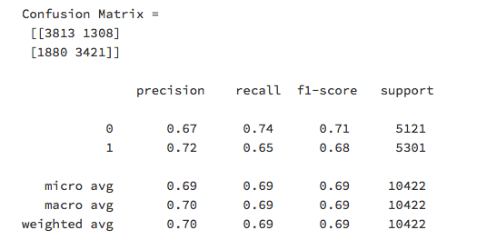
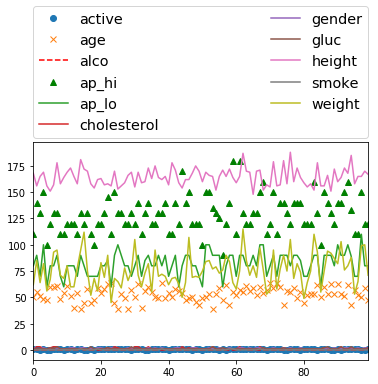

# CEBD1160-Final-Project
| Name | Date |
|:-------|:---------------|
|Qiaoyi Dong | March 19, 2020|

-----

### Resources

- Python script for your analysis: `cardio_analysis.py`
- Results figure/saved file:  `figures/`
- Dockerfile for your experiment: `Dockerfile`
- runtime-instructions in a file named RUNME.md
-----

## Research Question

Based on the factors that relavent to cardiovascular diseases，Can we perdict what kind of people would most likely have the diseases?
 
### Abstract

Derived from the historical cardiovascular diseases database, we could have the information about the factors that related with the cardio diseases. By using theses data, we could understand that the level of impact for each of these facters could have to cause the cardio diseases. We will try to predict if the people will get the cardio diseases or not by analysis the connectivity among factors and cardio diseases. The model shows that age,gender and weight have more impact than other facters, and we could predic the diseases by that but we also need further analysis.

### Introduction

The number of cardiovascular diseases has increased in recent years, and it has become one of the important topics for medical research. The data set includes 70,000 patient data records with 12 characteristics such as age, gender, systolic blood pressure, and diastolic blood pressure. When the patient has cardiovascular disease, the target class "cardio" is equal to 1, and if the patient is healthy, it is 0.

### Methods

The method used for modelling this data was the Logistic Regressor built into scikit-learn. Pseudocode (and in particular, the objective function being minimized) can be found [here](https://scikit-learn.org/stable/modules/generated/sklearn.linear_model.LogisticRegression.html#sklearn.linear_model.LogisticRegression).

### Results

The performance of the regressor was an k value of 0.679. The figure below shows the performance on the testing set and the confudion matrix.

### Discussion
The method used here solve the problem of identifying the most relavent factor to the cardiovascular diseases. I compared the relationship ofcardiovascular diseases with each factor and deleted the data that unrelated.

### References
https://scikit-learn.org/stable/modules/classes.html#module-sklearn.linear_model
https://www.kaggle.com/sulianova/cardiovascular-disease-dataset

-------
